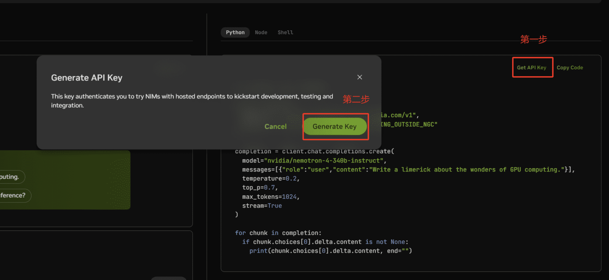

# 基于 NIM 建构多模态 AI-Agent 
## 项目概述：
基于NIM构建多模态AI-Agent，适合初学者和小白，了解工作原理，快速搭建多模态智能体实现特定工作。本项目示例为从图表中读取信息，修改信息，重新绘制图片，工作流程为：接收图片 -> 分析数据 -> 修改数据 -> 生成绘制图片的代码 -> 执行代码 -> 展示结果，在这个示例的基础上可以根据业务需求定义更复杂的流程，也可以多智能体结合。
## 技术方案：
- 多模态模型基于 NIM 的调用方式

申请NIM的API Key，来调用NIM的计算资源
进入https://build.nvidia.com/microsoft/phi-3-vision-128k-instruct, 点击Get API Key按钮，生成一个秘钥
 
- 基于 llama3-70b-instruct和Phi-3-Vision 的AI-Agent实践
- 基于 Gradio 框架建立前端互动界面
### 1.环境搭建：
主要需要三个工具包:
* `langchain_nvidia_ai_endpoint`: 用来调用nvidia nim的计算资源
* `langchain`: 用来构建对话链, 将智能体的各个组件串联起来
* `base64`: 因为本实验是构建多模态的智能体, 需要base64来对图像进行编解码
pip install -r requirements.txt -i https://pypi.tuna.tsinghua.edu.cn/simple
### 2.代码实现：
- 图片解析
    - 图片编码
    - Microsoft Phi 3 vison解析图片
- AI-Agent
    - 应用场景：将图片中的统计图表转换为可以用 python 进行分析的数据
    - Agent 工作流：
        - 接收图片，读取图片数据
        - 对数据进行调整、分析
        - 生成能够绘制图片的代码,并执行代码
        - 根据处理后的数据绘制图表
- 封装进gradio
## 结果展示：
- 用场景展示： 数据分析
- 功能演示：
 
 

## 总结与展望：
- 项目评估：这是一个面向新手的入门级demo，旨在快速搭建多模态大模型应用，熟悉流程，了解工作原理，是一个简单但完整的项目，具体在业务中使用还有诸多需要优化的点，需要深入了解。
- 未来方向：大模型的小型化。

